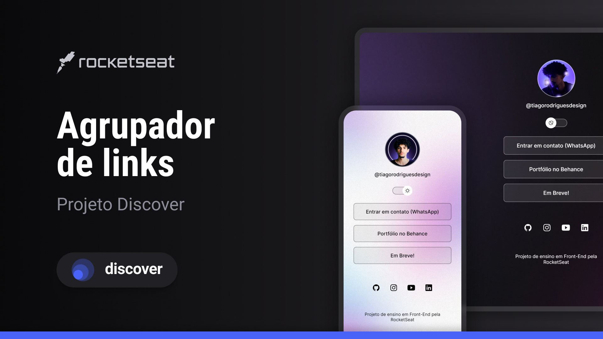

<h1 align="center"> Agrupador de Links </h1>

Programa exclusivo e gratuito, desenvolvido como prática de estudo em tecnologias WEB.  

  <a href="#-tecnologias">Tecnologias</a>&nbsp;&nbsp;&nbsp;|&nbsp;&nbsp;&nbsp;
  <a href="#-projeto">Projeto</a>&nbsp;&nbsp;&nbsp;|&nbsp;&nbsp;&nbsp;
  <a href="#-layout">Layout</a>&nbsp;&nbsp;&nbsp;|&nbsp;&nbsp;&nbsp;
  <a href="#memo-licença">Licença</a>

  

 

  

## 🚀 Tecnologias

Esse projeto foi desenvolvido com as seguintes tecnologias:

- HTML e CSS
- JavaScript
- Git e Github
- Figma

## 💻 Projeto

O projeto é um agrupador de links, utilizado como cartão de visitas online, construído como parte do aprendizado em desenvolvimento Front-End fornecido pela plataforma [RocketSeat](https://rocketseat.com.br)

- [Acesse o projeto finalizado, online](https://tiagodrss.github.io/agrupador-de-links/)

## 🔖 Layout

Você pode visualizar o layout original do projeto através [desse link](<https://www.figma.com/file/UO2UT4Zk3DB8xn9TYNMxMe/DevLinks-%E2%80%A2-Projeto-Discover-(Community)?type=design&node-id=1437%3A191&mode=design&t=4pwpp6468UNTU1RC-1>). É necessário ter conta no [Figma](https://figma.com) para acessá-lo.

## :memo: Licença

Esse projeto está sob a licença MIT.

---
